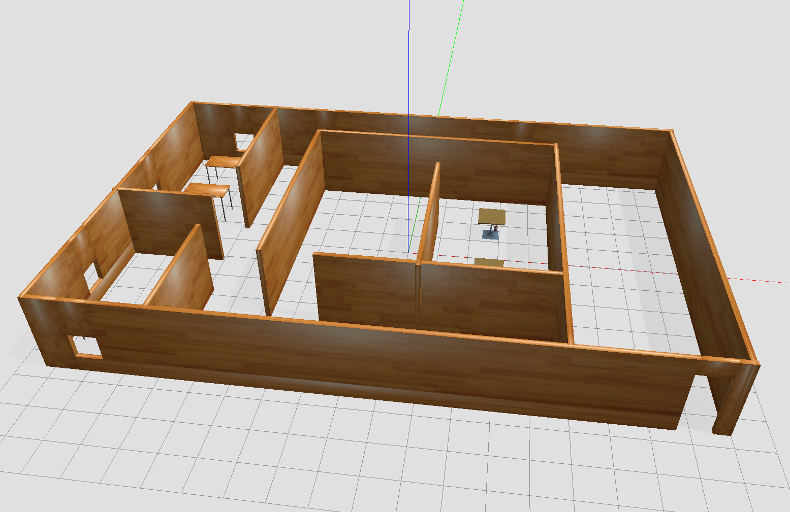

# Build My World Project

## Building



## Gazebo

Create a building with a building editor in Gazebo.
Be sure to save the building from the building editor so that the building can be reused in other world.

Create models with a model editor in Gazebo.
Be sure to save the building from the building editor so that the building can be reused in other world.

## Path to find models

``` sh
export GAZEBO_PLUGIN_PATH=${GAZEBO_PLUGIN_PATH}:~/git/RoboticsSoftwareEngineer/BuildMyWorld/build
export GAZEBO_MODEL_PATH=${GAZEBO_MODEL_PATH}:~/git/RoboticsSoftwareEngineer/BuildMyWorld/model
```

## Make plugin

```
$ cd build/
$ cmake ../
$ make
```


``` sh
export GAZEBO_PLUGIN_PATH=${GAZEBO_PLUGIN_PATH}:~/git/RoboticsSoftwareEngineer/BuildMyWorld/build
```

